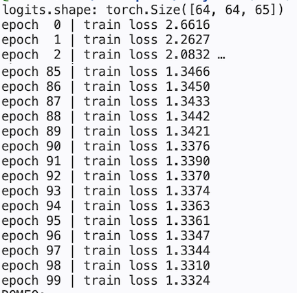
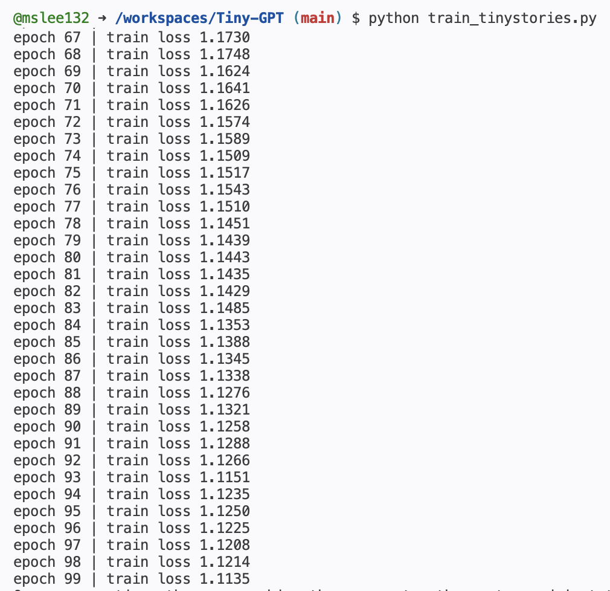
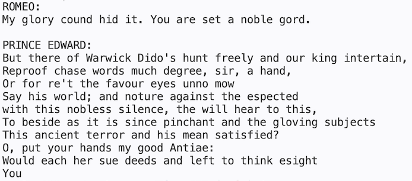
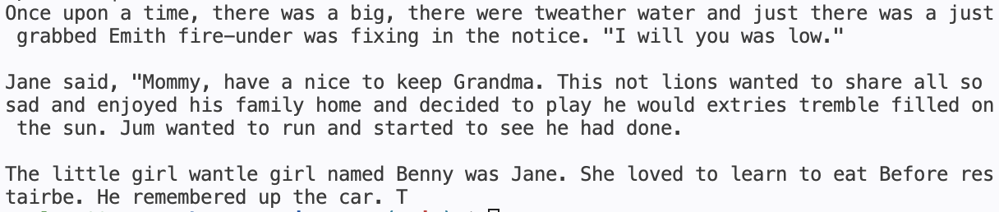

# GPT2.0

PyTorch를 사용하여 문자 단위 GPT 모델을 직접 구현한 프로젝트입니다.

본 프로젝트는 Tiny Shakespeare와 TinyStories 두 개의 데이터셋을 활용하여 학습하였으며, Transformer의 핵심 구조인 Self-Attention, Multi-Head Attention, FeedForward Network, Residual Connection, Layer Normalization 등을 직접 구현하여 GPT의 동작 원리를 이해하는 것을 목표로 하였습니다.

---

## 프로젝트 개요

대규모 언어 모델(LLM)을 단순히 사용하는 것이 아니라, GPT가 실제로 어떤 구조로 이루어져 있으며 어떻게 학습되는지를 이해하기 위해 구현하였습니다.

본 프로젝트에서는 다음 요소들을 직접 구현하였습니다.

* Character-Level Tokenization
* Token Embedding
* Positional Embedding
* Self-Attention
* Multi-Head Attention
* FeedForward Network
* Residual Connection
* Layer Normalization
* Cross Entropy Loss
* AdamW Optimizer
* Autoregressive Text Generation

또한 동일한 GPT 구조를 서로 다른 데이터셋에 학습시켜, 학습 데이터의 특성이 생성 결과에 어떤 영향을 미치는지 비교해보았습니다.

---

## 프로젝트 구조

```text
.
├── train_shakespeare.py
├── train_tinystories.py
├── data
│   ├── shakespeare.txt
│   └── tinystories.txt
├── images
│   ├── shakespeare_training.png
│   ├── shakespeare_sampling.png
│   ├── tinystories_training.png
│   └── tinystories_sampling.png
└── README.md
```

---

## 데이터셋

본 프로젝트에서는 두 개의 데이터셋을 사용하였습니다.

### 1. Tiny Shakespeare

Tiny Shakespeare는 Shakespeare 작품 일부를 모은 데이터셋으로, Character-Level GPT 실습에 널리 사용됩니다.

고전 영어 문체와 희곡 형식의 대사가 포함되어 있으며, 학습 후에는 Shakespeare 스타일의 문장과 대사 형식을 생성하는 경향을 보입니다.

예시:

```text
ROMEO:
But soft! what light through yonder window breaks?
```

---

### 2. TinyStories

TinyStories는 짧은 영어 동화들로 구성된 데이터셋입니다.

Shakespeare 데이터셋보다 문장이 단순하고 현대적인 영어 표현이 많으며, 이야기 형식의 텍스트를 포함하고 있습니다.

학습 후에는 비교적 자연스럽고 단순한 영어 문장을 생성하는 경향을 보입니다.

예시:

```text
Once upon a time, there was a little girl who had a red ball.
```

---

두 데이터셋 모두 모델이 이전 문자들을 보고 다음 문자를 예측하는 방식으로 학습됩니다.

예시:

```text
입력(x)  : h e l l
정답(y) : e l l o
```

즉, 입력 시퀀스를 한 칸 이동시킨 데이터를 정답으로 사용하여 Next Token Prediction을 수행합니다.

---

## 학습 설정

두 데이터셋 모두 동일한 GPT구조를 사용하여 학습하였습니다.

다만 Tinystories는 Tiny Shakespeare보다 데이터 양이 훨씬 많기 때문에 학습 시간을 고려하여 학습 스텝 수를 조정하였습니다.

### Tiny Shakespeare

```python
for epoch in range(100):
    train_loss = train_one_epoch(
        model,
        loader,
        optimizer,
        device,
        max_steps=300
    )
```

### TinyStories

```python
for epoch in range(100):
    train_loss = train_one_epoch(
        model,
        loader,
        optimizer,
        device,
        max_steps=100
    )
```

---

## 모델 구조

### 1. Token Embedding

문자를 정수 인덱스로 변환한 뒤 임베딩 벡터로 변환합니다.

```python
self.token_embedding = nn.Embedding(vocab_size, emb_dim)
```

각 문자는 학습 가능한 벡터 표현을 가지게 되며, GPT는 이 벡터 공간에서 문맥을 학습합니다.

---

### 2. Positional Embedding

Transformer는 토큰의 순서를 알 수 없기 때문에 위치 정보를 추가합니다.

```python
h = token_embedding + position_embedding
```

이를 통해 모델은

```text
ABC
```

와

```text
CBA
```

를 서로 다른 문장으로 인식할 수 있습니다.

---

### 3. Self-Attention

Self-Attention은 현재 토큰이 문장 내 어떤 토큰을 참고해야 하는지 계산합니다.

이를 위해 Query(Q), Key(K), Value(V)를 생성합니다.

```python
q = self.query(x)
k = self.key(x)
v = self.value(x)
```

Attention Score는 다음과 같이 계산됩니다.

```text
QKᵀ / √d
```

이를 통해 각 토큰은 문맥상 중요한 다른 토큰에 집중할 수 있습니다.

---

### 4. Causal Mask

GPT는 자기회귀(Autoregressive) 모델이므로 미래 토큰을 볼 수 없습니다.

이를 위해 하삼각 행렬(Lower Triangular Matrix)을 사용하여 미래 정보를 차단합니다.

```text
1 0 0 0
1 1 0 0
1 1 1 0
1 1 1 1
```

마스크는 다음과 같이 저장됩니다.

```python
self.register_buffer(
    "tril",
    torch.tril(torch.ones(block_size, block_size))
)
```

`register_buffer()`를 사용하여 학습 대상은 아니지만 모델과 함께 저장되며 GPU로 이동할 수 있도록 구현하였습니다.

---

### 5. Multi-Head Attention

여러 개의 Attention Head를 사용하여 서로 다른 문맥 정보를 동시에 학습합니다.

```python
self.heads = nn.ModuleList(...)
```

각 Head는 서로 다른 패턴을 학습할 수 있습니다.

예를 들어:

* 단기 문맥
* 장기 의존성
* 문장 구조
* 반복 패턴

등을 각각 학습할 수 있습니다.

각 Head의 출력은 결합(concatenate)된 후 Projection Layer를 통과합니다.

```python
out = self.proj(out)
```

이를 통해 여러 Head의 정보를 하나의 표현으로 통합합니다.

---

### 6. FeedForward Network

Attention이 모아온 정보를 추가적으로 가공하는 역할을 수행합니다.

```python
Linear(emb_dim → 4 × emb_dim)
ReLU
Linear(4 × emb_dim → emb_dim)
```

Attention이 "어디를 볼지" 결정한다면,

FeedForward Network는 "모은 정보를 어떻게 해석할지" 학습합니다.

---

### 7. Residual Connection

Transformer의 핵심 구조 중 하나입니다.

```python
x = x + self.sa(...)
x = x + self.ffwd(...)
```

원래 입력 정보를 유지하면서 새로운 정보를 추가할 수 있도록 합니다.

Residual Connection은 깊은 네트워크에서도 안정적인 학습을 가능하게 합니다.

---

### 8. Layer Normalization

학습을 안정화하기 위해 사용됩니다.

본 프로젝트는 GPT 계열 모델에서 널리 사용되는 Pre-LN 구조를 사용합니다.

```python
self.sa(self.ln1(x))
self.ffwd(self.ln2(x))
```

Layer Normalization은 Gradient 흐름을 안정화하고 학습 속도를 향상시킵니다.

---

## 학습 과정

모델은 다음 과정을 반복하며 학습됩니다.

```text
입력
 ↓
TinyGPT
 ↓
Logits 생성
 ↓
Cross Entropy Loss 계산
 ↓
Backpropagation
 ↓
가중치 업데이트
```

---

### Loss Function

다음 문자 예측 성능을 측정하기 위해 Cross Entropy Loss를 사용합니다.

```python
F.cross_entropy(...)
```

Loss가 감소할수록 모델이 다음 문자를 더 정확하게 예측하고 있음을 의미합니다.

---

### Optimizer

모델 학습에는 AdamW Optimizer를 사용하였습니다.

```python
torch.optim.AdamW(...)
```

AdamW는 Transformer 및 LLM 학습에 가장 널리 사용되는 최적화 알고리즘 중 하나입니다.

---

## 실행 방법

Tiny Shakespeare 데이터셋으로 학습:

```bash
python train_shakespeare.py
```

TinyStories 데이터셋으로 학습:

```bash
python train_tinystories.py
```

---

## 학습 실행 로그

### Tiny Shakespeare Training Log



### TinyStories Training Log



---

## 텍스트 생성

학습이 완료된 후 GPT는 한 번에 한 글자씩 생성합니다.

생성 과정은 다음과 같습니다.

```text
시작 문장 입력
 ↓
다음 문자 예측
 ↓
Softmax
 ↓
Multinomial Sampling
 ↓
문자 추가
 ↓
새로운 문맥 생성
 ↓
반복
```

예를 들어

```text
ROMEO:
```

를 입력하면 모델은 Shakespeare 스타일의 문장을 이어서 생성합니다.

TinyStories 모델의 경우에는 이야기 형식의 영어 문장을 생성하는 모습을 확인할 수 있습니다.

---

### Multinomial Sampling

텍스트 생성 시 가장 높은 확률의 문자만 선택하지 않고,

```python
torch.multinomial(...)
```

을 사용하여 확률 분포에서 샘플링합니다.

이를 통해 더욱 자연스럽고 다양한 문장을 생성할 수 있습니다.

---

## 생성 결과

### Tiny Shakespeare Sampling Result



### TinyStories Sampling Result



---

## 결과 비교

동일한 GPT 구조를 사용하더라도 학습 데이터셋에 따라 생성되는 문장의 스타일이 달라지는 것을 확인할 수 있었습니다.

* Tiny Shakespeare → 희곡 형식, 인물 이름, 고전 영어 문체
* TinyStories → 이야기 형식, 단순한 문장 구조, 현대 영어 표현

이를 통해 언어 모델의 생성 결과는 모델 구조뿐 아니라 학습 데이터의 특성에도 크게 영향을 받는다는 점을 확인할 수 있었습니다.

---

## 구현하며 학습한 핵심 개념

* Transformer Architecture
* Character-Level Language Modeling
* Token Embedding
* Positional Embedding
* Self-Attention
* Query, Key, Value
* Multi-Head Attention
* Causal Masking
* FeedForward Network
* Residual Connection
* Layer Normalization
* Cross Entropy Loss
* Backpropagation
* AdamW Optimization
* Autoregressive Generation
* Multinomial Sampling

---

## 프로젝트 의의

본 프로젝트는 GPT-2, GPT-3, ChatGPT와 같은 대규모 언어 모델의 핵심 구조를 축소된 형태로 직접 구현한 프로젝트입니다.

비록 모델 규모는 매우 작지만 다음과 같은 현대 LLM의 핵심 원리를 모두 포함하고 있습니다.

* Next Token Prediction
* Self-Attention 기반 문맥 이해
* Multi-Head Attention
* Transformer Block 구조
* Residual Connection
* Layer Normalization
* Autoregressive Text Generation

또한 두 개의 서로 다른 데이터셋(Tiny Shakespeare, TinyStories)을 사용하여 학습을 진행함으로써, 데이터셋의 특성이 모델의 생성 결과에 어떤 영향을 미치는지 직접 확인할 수 있었습니다.

이를 통해 Transformer 기반 언어 모델이 학습되고 텍스트를 생성하는 전 과정을 직접 구현하고 이해할 수 있었습니다.
